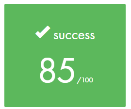
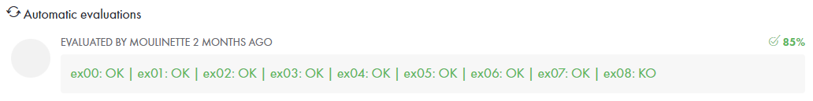

# <h1 align="center"> :white_check_mark: C00</h1>

The aim of this project is to find the biggest square on a map, avoiding the obstacles. 
[Subject](https://github.com/CodinaFJ/42SchoolMadrid/blob/main/Piscine/Resources/Subjects/en.subject_C00.pdf)

# <h2 align="center"> Evaluation </h1>

 
 

