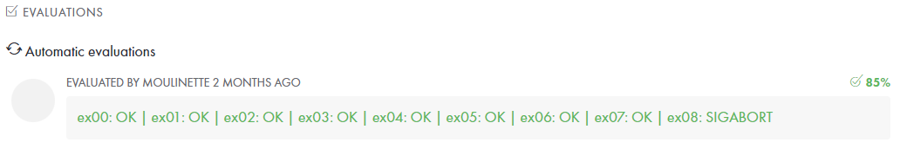

# <h1 align="center"> :white_check_mark: C01</h1>

Basic pointers functions. 
<a href="../Resources/Subjects/en.subject_C01.pdf">Subject</a>

# <h2 align="center"> Evaluation </h1>

 
 

 
 
 

###### Legend
:black_square_button: _Ongoing_ 
:ballot_box_with_check: _Closed_ 
:white_check_mark: _Complete_ 
