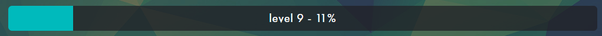
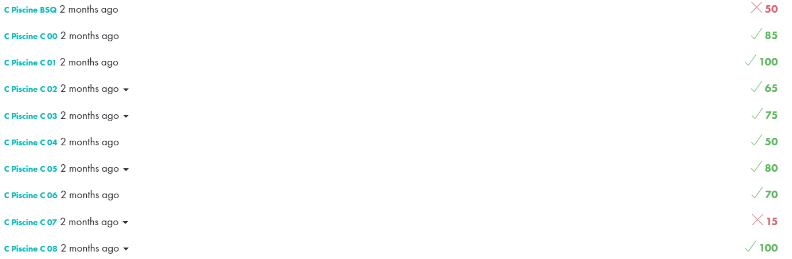
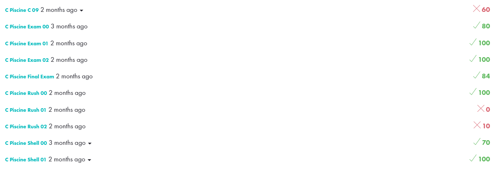

# <h1 align="center"> :ballot_box_with_check: PISCINE</h1>

For one month, the Piscine at 42 lets you tackle the teaching methods of the school: peer-to-peer learning, group work, peer-evaluation and project pedagogy. 
   
01/11/2022 - 26/11/2022

# <h2 align="center"> Evaluation </h2>

 
 
   

 
 
 

###### Legend
:black_square_button: _Ongoing_ 
:ballot_box_with_check: _Closed_ 
:white_check_mark: _Complete_ 
