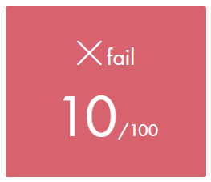
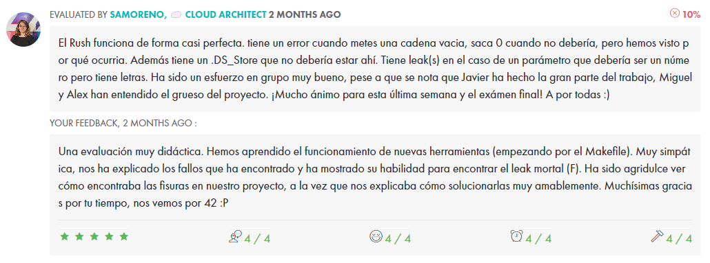

# <h1 align="center"> :ballot_box_with_check: Rush02</h1>

 Translate a number introduced with digits to words using a given dictionary. 
 i.e: 267 -> Two hundred sixty seven 
<a href="../Resources/Subjects/en.subject_rush02.pdf">Subject</a>

# <h2 align="center"> Evaluation </h1>

 
 

 
 
 

###### Legend
:black_square_button: _Ongoing_ 
:ballot_box_with_check: _Closed_ 
:white_check_mark: _Complete_ 
